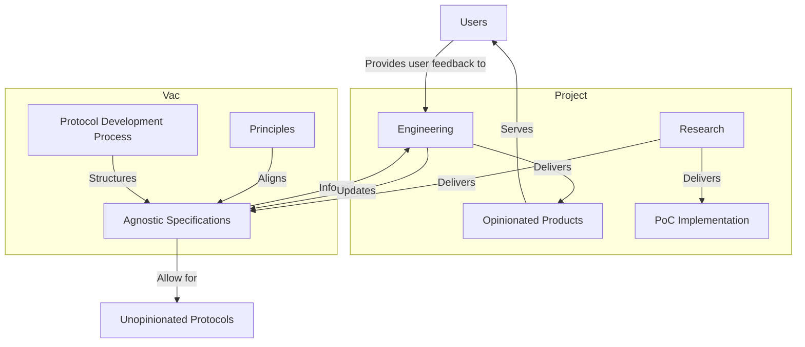

We build public good protocols for everyone, then implement them the way that works for us.

Public goods are for the people, and thus should be owned and controlled by them. How they are built influences this outcome. To this end, we have come up with a process that helps to ensure that the products of our effort are not solely controlled by us and our potentially limited self-interests and opinions. 

In a nutshell, Logos projects will work hand-in-hand with our sister research organization, Vac, to create agnostic protocols for everyone to share and contribute to. You can read more about Vac and their mission [here](https://vac.dev). 

The general flow of how a given project within Logos collaborates with Vac is summarized in the following diagram. 

A Logos project will perform research on a problem. Their initial deliverables will be a Proof of Concept (PoC) and a set of specifications that detail explicitly how that solution is built. Vac will provide resources to the Logos project by facilitating in the process writing and hardening the specifications being developed. 

In addition to helping in the process of spec writing, they also serve as an embodiment of the foundational principles that maintain the ethical development of public good infrastructure. This means that specifications written, developed, and housed with Vac are not tied to any given chain, biased ideology, and the subsequent control that comes from it. These specifications can then be used by the general public in any way they see fit, free and open source. 

The Logos project will then pull back an opinionated view of these specifications to implement their vision of how the product should be built for their particular use case. 

This process is our commitment to build in the open and work to maintain an ethos of building for the public good while also allowing ourselves to create opinionated products that suit our specific needs.