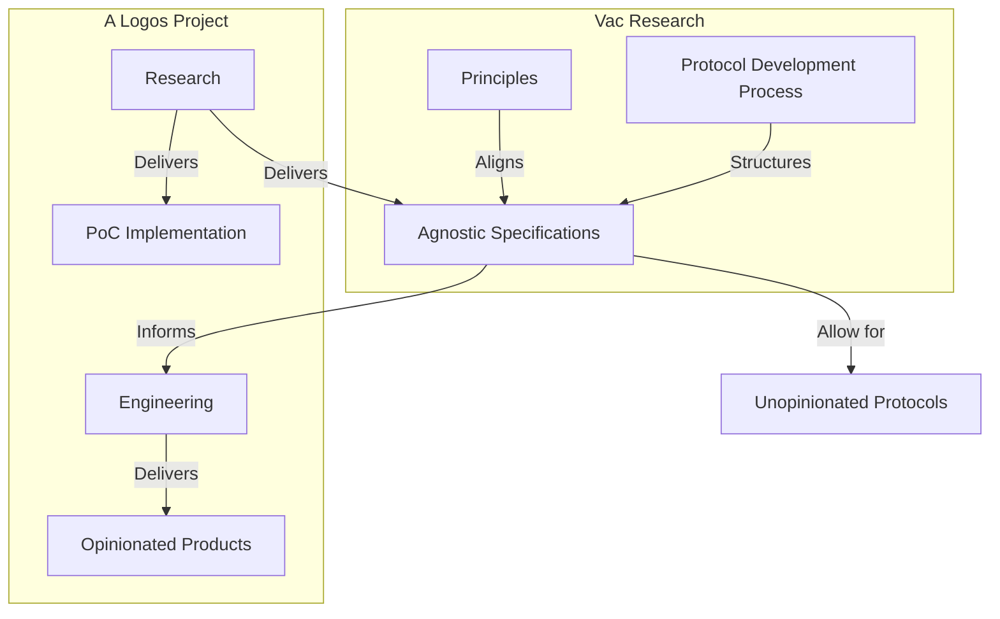

## **Logos is building a complete decentralised infrastructure stack - for everyone.**

Our vision of the future provides a pathway for individuals to be able to enforce their own property and privacy rights, and to experiment with new means of social and economic coordination.

This requires a re-imagining of the public internet infrastructure upon which we conduct our lives. Logos’ answer to this is an ambitious experiment to will web3 into existence. At its foundation, Logos is comprised of three primary modular peer-to-peer protocols for communication, file storage and trustless agreement. 

Individually, they are designed to be easily incorporated into other established systems. Together, they form the foundational public infrastructure required for the next generation of social institutions to emerge.

### Our Process

We build public good protocols for everyone, then implement them the way that works for us

Public goods are for the people, and thus should be owned and controlled by them. How they are built influences this outcome. To this end, we have come up with a process that helps to ensure that the products of our effort are not solely controlled by us and our potentially limited self-interests and opinions. 

In a nutshell, Logos projects will work hand-in-hand with our sister research organization, Vac, to create agnostic protocols for everyone to share and contribute to. You can read more about Vac and their mission [here](https://vac.dev). 

The general flow of how a given project within Logos collaborates with Vac is summarized in the following diagram. 

A Logos project will perform research on a problem. Their initial deliverables will be a Proof of Concept (PoC) and a set of specifications that detail explicitely how that solution is built. Vac will provide resources to the Logos project by facilitating in the process writing and hardening the specifications being developed. 

In addition to helping in the process of spec writing, they also serve as an embodiment of the foundational principles that maintain the ethical development of public good infrastructure. This means that specifications written, developed, and housed with Vac are not tied to any given chain, biased ideology, and the subsequent control that comes from it. These specifications can then be used by the general public in any way they see fit, free and open source. 

The Logos project will then pull back an opinionated view of these specifications to implement their vision of how the product should be built for their particular use case. 

This process is our commitment to build in the open and work to maintain an ethos of building for the public good while also allowing ourselves to create opinionated products that suit our specific needs. 

**Waku** - *The ephemeral communication layer.*

Waku is a peer-to-peer communication layer.

The first protocol in Logos’ stack is Waku, which has its origins in Ethereum’s Whisper protocol, but is optimized for scalability and better usability. 

Waku removes centralized third parties from messaging - enabling private, secure, censorship-free communication. Waku is designed for generalized messaging, enabling both human-to-human, machine-to-machine communication, and everything in between. Waku is in production and is actively being used by projects like [Status](https://www.status.im) and [WalletConnect v2.](https://walletconnect.com/)  It’s economic spam protection is still under research, and a paper published on the topic can be found [here](https://raw.githubusercontent.com/vacp2p/research/master/rln-research/Waku_RLN_Relay.pdf)

[Read more]("/technology/waku")

**Codex** - *The storage layer.* 

Codex is a decentralized file storage network.

Whilst p2p storage networks have been around for quite a long time, the lack of incentives, strong data availability, and persistence guarantees make 
these networks unsuitable for applications with moderate to high availability requirements. In other words, without reliability at the storage layer it is 
impossible to build other reliable applications on top of it. Codex aims to solve this by supplying:
• An incentivized p2p storage network with strong availability and persistence guarantees.
• A resource restricted friendly protocol that can endure higher levels 
of churn and large amounts of ephemeral devices.

Codex has a working PoC, as is expected to be in production by 2023.

[Read more]("/technology/codex")

**Logos** - *The trustless agreements layer*. 

Logos Blockchain is a heterogeneous blockchain network.

The third component of the Logos’ stack is a blockchain network that aims to provide fast, scalable and secure smart contracts, with near-instant transaction finality. We’re developing a leaderless consensus algorithm, which is currently under active research. Our current repos and tests are set to private until the research begins to mature slightly, but are available on request.

The first two client implementations will be written in Nim and Rust. The same team developing [Nimbus](https://nimbus.team/) one of the leading Ethereum Consensus Clients, will expand its resources to take on the Nim implementation once the first specification has been published.

[Read more]("/technology/blockchain")

---

Logos is not yet in production across every protocol in its stack. A number of research and engineering problems remain. We have no disillusions to the magnitude of the undertaking, and the work still ahead of us. We invite anyone who is serious about contributing research or to its code-base to join the community and get involved.
